# Neon Wave Fitness Club

 

 ## Contents

- [Overview](#overview)
- [Scope](#scope)
  - [Existing Features](#existing-features)
  - [Future Features](#future-features)
- [User Experience](#user-experience)
  - [User stories](#user-stories)
  - [Flowchart](#flowchart)
  - [Wireframes](#wireframes)
- [Design](#design)
  - [Typography](#typography)
  - [Colour Scheme](#colour-scheme)
  - [Layout](#layout)
- [Technologies Used](#technologies-used)
  - [Languages](#languages)
  - [Frameworks, Libraries and Programs Used](#frameworks-libraries-and-programs-used)
- [Testing](#testing)
  - [Validating](#validating)
  - [Automated and Manual Testing](#automated-and-manual-testing)
  - [Fixed Bugs](#fixed-bugs)
- [Deployment](#deployment)
  - [Cloning](#cloning)
  - [Forking](#forking)
  - [Deployment on Heroku](#deployment-on-heroku)
  - [Local Deployment](#local-deployment)
- [Credits](#credits)
  - [Content](#content)
  - [Media](#media)
- [Acknowledgments](#acknowledgments)

## Overview

The Neon Wave Fitclub Booking System is a Django-based application designed to provide users with a seamless booking experience for gym classes. With an intuitive interface and admin control, users can easily manage their bookings, while admins can efficiently manage class schedules and member capacities.
 [View the deployed project here](https://neonwave-f34ab6b9a029.herokuapp.com/).

## Scope

### Existing Features:

1. **User Registration/Login:**
   - Users can register for an account to access the fitness class booking system.
   - Registered users can log in to manage their bookings easily.

2. **Viewing Fitness Classes:**
   - Admins can add new types of classes with details such as name, description, and duration.
   - Users can view a list of available fitness classes to choose from.

3. **Booking Classes:**
   - Admins can update the class agenda, including schedule changes or additional sessions.
   - Admins can limit the number of members for each class to ensure optimal class size.
   - Users can book fitness classes to reserve their spots and attend.

4. **Canceling Bookings:**
   - Users can cancel booked fitness classes to free up their spots or reschedule if needed.

5. **Performance Optimization:**
   - The app layout adjusts seamlessly to different screen sizes for a consistent user experience.

6. **Feedback and Suggestions:**
   - Admins can review and approve user comments and reviews about classes or the overall experience.
   - Users can provide feedback on the app to share thoughts and suggestions.

### Future Features:

1. **Performance Optimization:**
   - Users can filter the classes by day, time or type.

2. **Payment Integration:**
   - Users can pay for classes online to complete the booking process easily.
   - Users receive a receipt or confirmation of payment for transaction proof.

3. **Notifications:**
   - Users receive email notifications for booking confirmations and cancellations to stay updated.
   - Users receive reminders for upcoming classes to ensure attendance.

## User Experience

### User Stories

1. **Registration/Login:**
   - As a new user, I want to register for an account to access fitness class bookings.
   - As a registered user, I want to log in to manage my bookings easily.

2. **Viewing Classes:**
   - As an admin, I want to add new classes with details for user selection.
   - As a user, I want to view available fitness classes to choose from.

3. **Booking Classes:**
   - As an admin, I want to update class schedules and manage member capacities.
   - As a user, I want to book classes to reserve my spot.

4. **Canceling Bookings:**
   - As a user, I want to cancel booked classes to free up my spot.

5. **Performance Optimization:**
   - As a user, I want the app layout to adjust seamlessly to different screen sizes.

6. **Feedback and Suggestions:**
   - As an admin, I want to review user feedback and implement suggestions for improvement.
   - As a user, I want to provide feedback on the app and see it considered for implementation.

### Flowchart

 Entity-Relationship Diagram (ERD) to manage the table keys within the database for this project.

 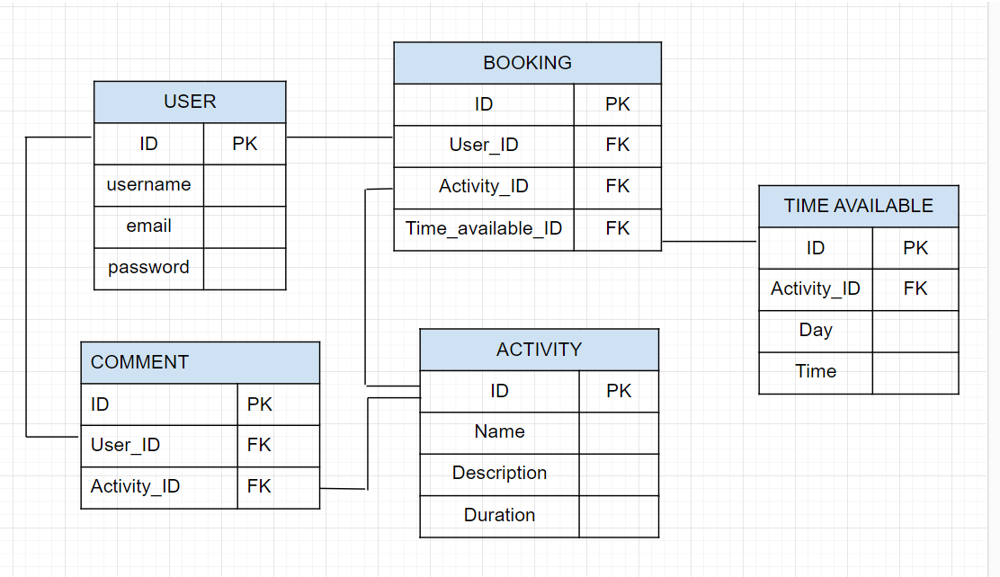

### Wireframes

Wireframes created using Balsamiq.

 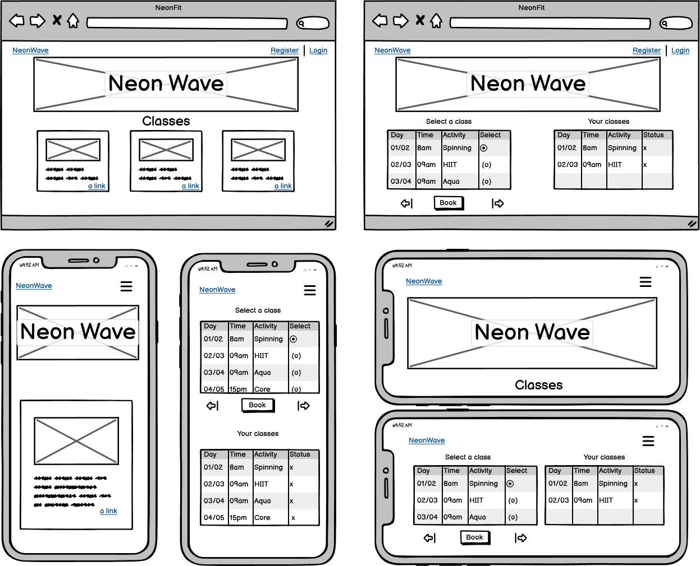

## Design

### Typography

 The headings use the [Catamaran font](https://fonts.google.com/specimen/Catamaran), which falls under the sans-serif category.
 For the body text, the [Lato font](https://fonts.google.com/specimen/Lato) is used, also falling under the sans-serif category.

### Colour Scheme

 The website's design draws inspiration from neon lights, creating a vibrant and futuristic atmosphere:

 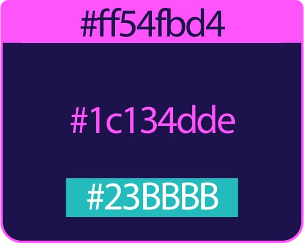

- **Background:** The background color resembles the deep, mysterious hues of a nighttime cityscape, with a shade reminiscent of midnight blue.
- **Highlights:** Vibrant pink hues are used for highlights throughout the website, adding pops of color that evoke the vibrant glow of neon signs.
- **Links and Buttons:** A bright turquoise shade is used for links and buttons, reminiscent of the cool, refreshing glow of neon lights against the night sky.

These colors work together to create a visually appealing, enhancing the overall ambiance of Neon Wave's online platform.

### Layout

- Home page:
 
 - Header:

  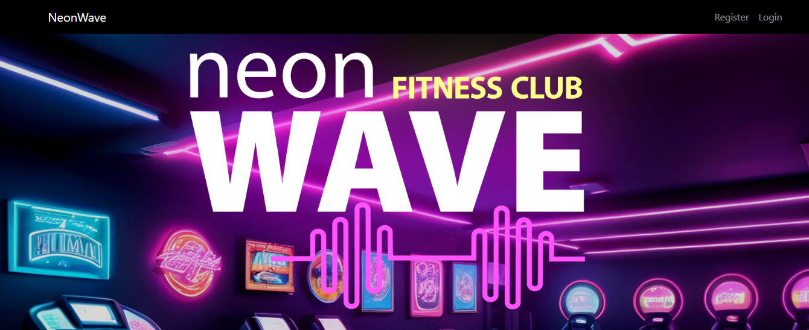

 - Body:
  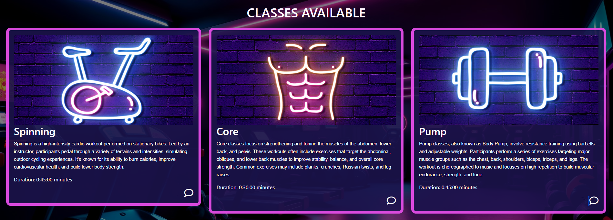

- Comments page:

  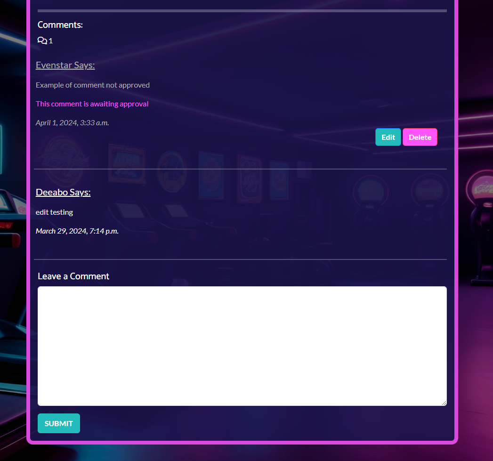

- Register, Login and Logout pages:

  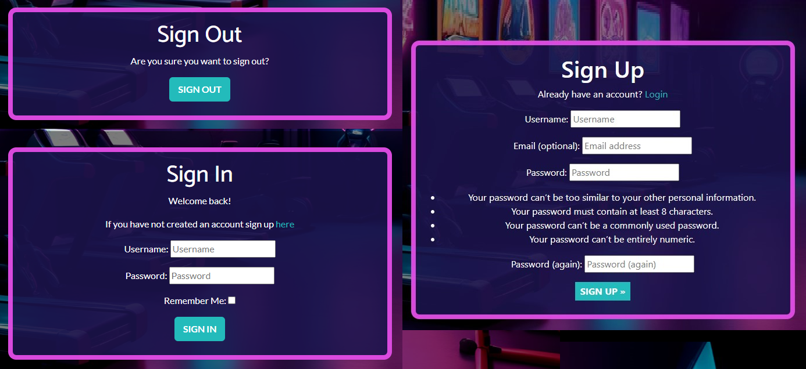

- Authenticated users area:

 - Editing comment:

  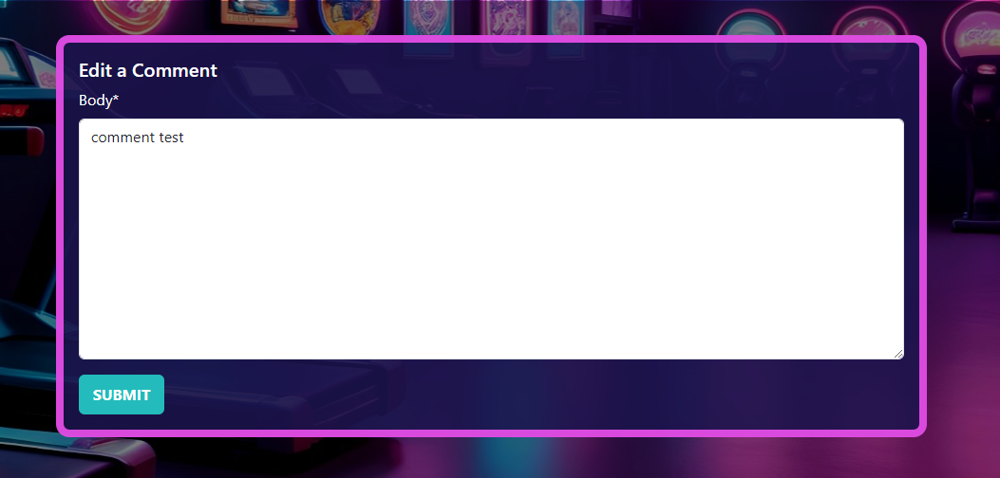

 - Booking classes:

  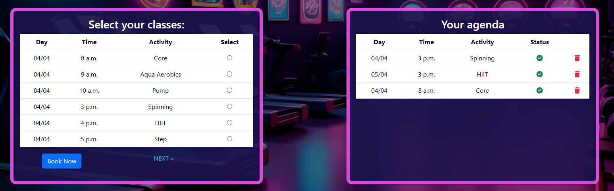
  
 - No bookings:

  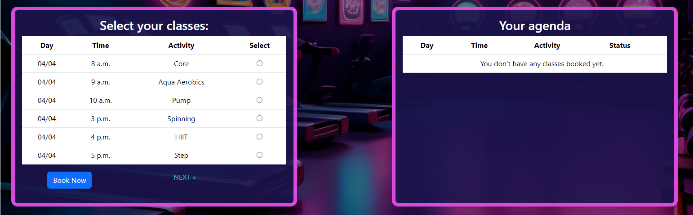

 - Booking limit:

  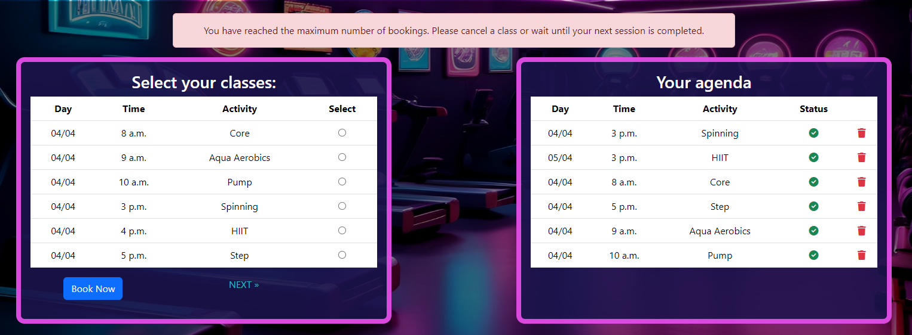

- Mobile:

 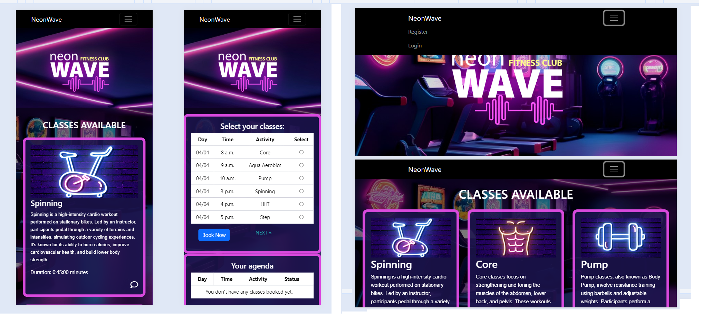

## Technologies Used

### Languages

 - [PYTHON](https://www.python.org/)

 - [JAVASCRIPT](https://en.wikipedia.org/wiki/JavaScript)

### Frameworks, Libraries and Programs Used

- **IDE:** [Codeanywhere](https://codeanywhere.com/): Integrated Development Environment (IDE) used for coding, testing, and project management.

- **Database Storage:** [ElephantSQL](https://www.elephantsql.com/): PostgreSQL as a Service used for storing the application's data.

- **Version Control:** [Git](https://git-scm.com/): Version control system used for managing project changes.

- **Code Hosting:** [GitHub](https://github.com/patilacerda): Hosting the project's code repository.

- **Deployment:** [Heroku](https://www.heroku.com/): Platform used for deploying the application to the web.

- **Design Tools:**

  - [Photoshop](https://www.adobe.com/products/photoshop.html): Graphics editor used for creating the project logo and colour scheme.

  - [Balsamiq](https://balsamiq.com/): Wireframing tool used for creating website mockups.

  - [Draw.io](https://app.diagrams.net/): Diagram software used to creating flowcharts.

- **Development Packages:**

  - [Django](https://www.djangoproject.com/): Web framework used for development.

  - [dj-database-url](https://pypi.org/project/dj-database-url/): A package used for database URL parsing.

  - [psycopg2](https://pypi.org/project/psycopg2/): PostgreSQL adapter for Python used with Django.

  - [django-allauth](https://django-allauth.readthedocs.io/en/latest/): Package for handling user authentication and registration.

  - [django-summernote](https://pypi.org/project/django-summernote/): Django integration for the Summernote editor.

  - [whitenoise](http://whitenoise.evans.io/en/stable/): Simplified static file serving for Django.

  - [cloudinary](https://cloudinary.com/): Cloud-based image and video management service.

  - [dj3-cloudinary-storage](https://pypi.org/project/dj3-cloudinary-storage/): Django storage backend for Cloudinary.

  - [urllib3](https://urllib3.readthedocs.io/): HTTP client for Python used for making requests.

  - [Gunicorn](https://gunicorn.org/): WSGI HTTP server for Python web applications, used for deploying Django applications on Heroku.

- **Other Tools:**

  - **Bootstrap:** [Bootstrap](https://getbootstrap.com/) Front-end framework used for designing responsive and mobile-first websites.

  - **Google Fonts:** [Google Fonts](https://fonts.google.com/) Used to gather the Catamaran and Lato fonts for typography in the project.

  - **Chrome Dev Tools:** Used for overall development, including testing responsiveness and performance.

  - **Font Awesome:** [FontAwesome](https://fontawesome.com/) Icon toolkit used for site icons.

  - **Favicon.io:** [Favicon](https://favicon.io/) Utilized for generating favicons to enhance the project's branding and visual identity.

  - **HTML Formatter:** [FreeFormatter](https://www.freeformatter.com/html-formatter.html): Used for formatting HTML code, correcting indentation issues and remove unnecessary whitespace.

## Testing

### Validating

 **HTML Validation** - [W3C Markup Validation Service](https://validator.w3.org/nu/)

 | Folder              | Template             | Status |
 |---------------------|----------------------|--------|
 | templates           | base.html            | Pass   |
 | templates/account   | signup.html          | Fail   |
 |                     | login.html           | Pass   |
 |                     | logout.html          | Pass   |
 | training            | activity_list.html   | Pass   |
 |                     | activity_detail.html | Pass   |
 |                     | edit_comment.html    | Pass   |
 | booking             | booking.html         | Pass   |

  The error on 'signup.html' suggests that there are open or unclosed elements and stray end tags, which can lead to unexpected rendering behavior.
  This error is occurring within the  tag and the {{ form.as_p }} tag.
  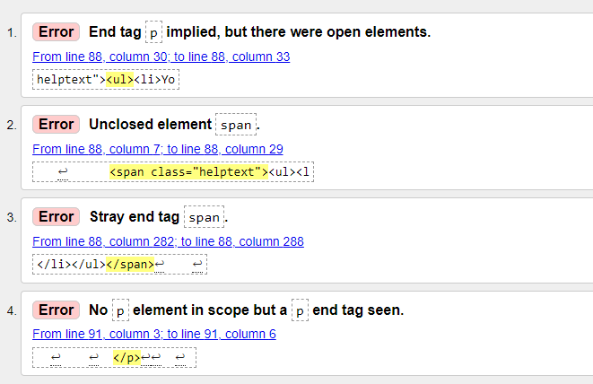

**CSS Validation** - [W3C CSS Validation Service](https://jigsaw.w3.org/css-validator/)

 | Folder              | File                 | Status |
 |---------------------|----------------------|--------|
 | static/css          | style.css            | Pass   |
 
 The CSS code passed validation with no errors.

**JavaScript Validation** - [JSHint](https://jshint.com/)

 | Folder              | Script               | Status |
 |---------------------|----------------------|--------|
 | static/js           | script.js            | Pass   |
 |                     | comments.js          | Pass   |

The JavaScript code passed validation with no errors.

**CI Python Linter** - [PEP8](https://pep8ci.herokuapp.com/)

 | Folder              | File.py              | Status |
 |---------------------|----------------------|--------|
 | training            | admin.py             | Pass   |
 |                     | forms.py             | Pass   |
 |                     | models.py            | Pass   |
 |                     | test_views.py        | Pass   |
 |                     | urls.py              | Pass   |
 |                     | views.py             | Pass   |
 | booking             | admin.py             | Pass   |
 |                     | forms.py             | Pass   |
 |                     | models.py            | Pass   |
 |                     | test_views.py        | Pass   |
 |                     | urls.py              | Pass   |
 |                     | views.py             | Pass   |

 No errors were returned when passing through the PEP8.

**Lighthouse**

 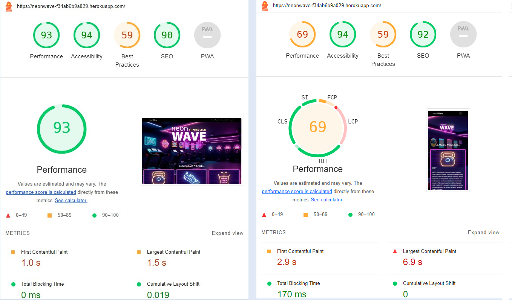

- Desktop 93% performance average 
- Mobile 69% performance average.

### Automated and Manual Testing

 **Manual testing**
 
 | Feature               | Steps                                                                                                              | Expected                                                                                       | Status |
|-----------------------|--------------------------------------------------------------------------------------------------------------------|------------------------------------------------------------------------------------------------|--------|
| Navigation            | 1. Open the website.                                                                                               | The homepage should be displayed with navigation links.                                       | Pass   |
|                       | 2. Click on the logo.                                                                                              | The homepage should reload.                                                                    | Pass   |
|                       | 3. Click on the "Register" link.                                                                                   | The user should be redirected to the registration page.                                       | Pass   |
|                       | 4. Click on the "Login" link.                                                                                      | The user should be redirected to the login page.                                              | Pass   |
|                       | 5. Log in with valid credentials.                                                                                   | The user should be logged in and redirected to the homepage.                                   | Pass   |
|                       | 6. Click on the "Logout" link.                                                                                     | The user should be logged out and redirected to the homepage.                                   | Pass   |
| Classes Display       | 1. Open the homepage.                                                                                              | The list of available classes should be displayed.                                             | Pass   |
|                       | 2. Scroll through the list of classes.                                                                              | Each class should display its name, description, duration, and an option to view comments.     | Pass   |
|                       | 3. Click on a class name.                                                                                           | The user should be redirected to the detail page of that class.                                 | Pass   |
|                       | 4. Scroll through the comments section.                                                                             | Comments related to the class should be displayed.                                             | Pass   |
| Commenting            | 1. Click on a class to view its detail page.                                                                        | The detail page of the class should be displayed.                                              | Pass   |
|                       | 2. Scroll to the comment section.                                                                                   | Existing comments related to the class should be visible.                                       | Pass   |
|                       | 3. Log in with valid credentials (if not already logged in).                                                        | The user should be logged in.                                                                   | Pass   |
|                       | 4. Enter a comment in the comment box.                                                                              | The comment should appear in the comment section.                                               | Pass   |
|                       | 5. Submit the comment.                                                                                             | The comment should be added to the list of comments.                                            | Pass   |
| Editing Comment       | 1. Click on the "Edit" button next to a comment (if authenticated as the commenter).                                | The comment editing form should be displayed.                                                  | Pass   |
|                       | 2. Modify the comment content.                                                                                      | The comment content should be updated after submission.                                          | Pass   |
|                       | 3. Click on the "Submit" button.                                                                                    | The edited comment should replace the original comment.                                          | Pass   |
|                       | 4. Click on the "Delete" button next to a comment (if authenticated as the commenter).                              | A confirmation modal should appear asking the user to confirm the deletion.                     | Pass   |
|                       | 5. Confirm the deletion.                                                                                            | The comment should be deleted from the list of comments.                                         | Pass   |
| Booking               | 1. Click on the "Book" link in the navigation.                                                                      | The user should be redirected to the booking page.                                             | Pass   |
|                       | 2. Select a class from the available options.                                                                       | The selected class should be added to the user's agenda.                                       | Pass   |
|                       | 3. Click on the "Book Now" button.                                                                                  | The booking should be confirmed, and the user's agenda should be updated.                       | Pass   |
|                       | 4. Click on the "Cancel" link next to a booked class.                                                               | A confirmation modal should appear asking the user to confirm the cancellation.                | Pass   |
|                       | 5. Confirm the cancellation.                                                                                        | The booked class should be removed from the user's agenda.                                      | Pass   |

 **Automated tests**

  - Training view:

  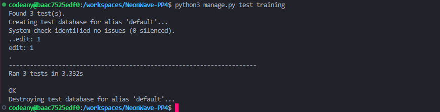

  - Booking View:

  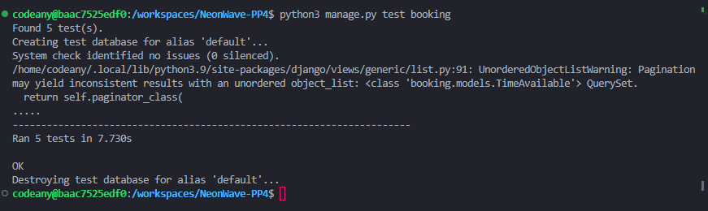

  Tests made with django TestCase - 8 tests were performed

### Known Bugs

 - Upon submitting a comment on the platform, if the user refreshes the page or navigates away and returns, the same comment is posted again. This results in duplicate comments appearing in the comments section.

## Deployment

 This project was developed using the [full template](https://github.com/Code-Institute-Org/ci-full-template) repository provided by Code Institute and hosted on GitHub.

 Before deploying your application, you need to set up environment variables to securely store sensitive information such as secret keys, database URLs, and API keys. Follow these steps to create an env.py file and define the necessary keys:

 - Create env.py: Within your project directory, create a file named env.py.

 - Define the following keys in the env.py file:

  - SECRET_KEY="YourSecretKeyHere"
  - DATABASE_URL="YourDatabaseURLHere"
  - CLOUDINARY_URL="YourCloudinaryURLHere"
  - os.environ["DEVELOPMENT"] = "True"
  - os.environ["DEBUG"] = "True"

### Cloning

To clone the repository, follow these steps:

 1. Locate the [repository link](https://github.com/patilacerda/NeonWave-PP4) on GitHub.
 2. Under the 'Code' button, you will see different cloning options, including HTTPS, SSH, and GitHub CLI. Click on your preferred cloning option.
 3. Copy the URL provided.
 4. Open your Terminal or Command Prompt.
 5. Navigate to the directory where you want to create the local clone. You can use the cd command to change the current working directory.
 6. Type the command "git clone <https://github.com/patilacerda/NeonWave-PP4/>"
 7. Press 'Enter' to execute the command. This will create a local clone of the repository in the specified directory.

### Fork

To fork the repository, follow these steps:

1. Navigate to the [repository link](https://github.com/patilacerda/NeonWave-PP4) on GitHub.
2. Click on the 'Fork' button in the upper right corner of the page. This will create a copy of the repository in your GitHub account.

### Deployment on Heroku

 The deployment process on Heroku involved the following steps:

 1. Add dependencies to the 'requirements.txt' file using the command "pip3 freeze > requirements.txt"
 2. Commit the changes and push to the GitHub repository.
 3. Access the Heroku Dashboard:
   - Create a new app and assign a name and location.
   - In the app's Settings tab, add Config Vars for credentials.
 4. Create a Procfile in the root directory of your project. This file tells Heroku how to run your application.
 5.  Specify the Python version by creating a runtime.txt file in the root directory of your project.
 6. Choose deployment method by selecting GitHub.
 7. Connect the Heroku app to the GitHub repository.
 8. Optionally, enable automatic deployment or manually trigger the deployment process.
 9. Finally, click on "Deploy" to initiate the deployment process to Heroku.

### Local Deployment

To deploy the application locally, follow these steps:

1. Ensure that you have Python and Django installed on your machine.
2. Navigate to the project directory using the Terminal or Command Prompt.
3. Install the required dependencies.
4. Apply migrations to set up the database.
5. Create a superuser account for admin access.
6. Run the development server using 'python3 manage.py runserver'.
7. Access the application at `http://localhost:8000` in your web browser.

## Credits

### Content

 Knowledge gathered from the following sources:

 - I Think Therefore I Blog Walkthrough  - The main page for this project was based on the walkthrough provided by Code Institute.
 - [Stack Overflow](https://stackoverflow.com/) - Assistance with deployment issues to Heroku, DurationField usage inside the booking model, conversion of timedelta.
 - [Studio Metropole](https://clients.mindbodyonline.com/classic/mainclass?fl=true&tabID=7) - The booking page was inspired by the booking system from Metropole Pole Dance Studio.
 - [Midlands Park Health and Fitness Club](https://www.midlandsparkhotel.com/leisure-spa/fitness-classes/) - Fitness knowledge was gathered to create the classes.

### Media
 
 - Background generate with AI on [FREEP!K](https://www.freepik.com/pikaso/text-to-image?oldtti=1&tti=1)

 - Featured images bought from royalty-free on [Creative Fabrica](https://www.creativefabrica.com/)

## Acknowledgments

I would like to express my heartfelt gratitude to everyone who supported me throughout the development of this challenging project.

First and foremost, I want to thank my facilitator, Marko, for his unwavering support and concern about my progress. His guidance and encouragement played a crucial role in keeping me motivated and focused.

I am also deeply grateful to my mentor, Antonio, for his patience and excellent teaching. His invaluable insights and constructive feedback have significantly contributed to my growth as a developer.

To my therapist, Cristiane, whose support and guidance have been instrumental in helping me navigate the challenges and doubts that arose during this project. 

To my husband, William, and all my friends who stood by me during the ups and downs of this journey, thank you for your unwavering support and encouragement. Your belief in me kept me going, even when doubts crept in.

Lastly, I want to extend my appreciation to everyone who has contributed to my personal and professional development. Your support has been invaluable, and I am truly grateful for your presence in my life.